# AML Project 4: Non-Linearity, Tree-Based Classification, and SVM

Course: CSCI-6767 Applied Machine Learning and Data Analytics (Spring 2026)  
Team: Gabil Gurbanov, Hamida Hagverdiyeva

---

## 1) Project Goal (What This Work Tries to Solve)

This project applies classical and modern machine learning techniques to two different real-world tasks:

1. A regression problem where relationships are non-linear.
2. A classification problem where multiple model families can be compared on the same data.

The objective is not only to maximize scores, but also to explain why some models work better, when they fail, and what each method contributes in terms of interpretability, scalability, and practical deployment.

---

## 2) Assignment Requirements (From `instructions.md`)

### Required tasks and weights

| Task | Requirement | Weight |
|---|---|---:|
| 1 | Non-linear models: polynomials, step functions, splines, local regression, GAMs | 30% |
| 2 | Tree-based methods: bagging, random forests, boosting | 30% |
| 3 | SVM with different kernels | 20% |
| 4 | Compare all models and write report | 20% |
| Extra | Build a clean, user-friendly UI with outputs | +20% |

### Presentation format

- 10 minutes total per team
- 5 minutes presentation + 5 minutes Q&A

### Report format (IEEE via Overleaf)

- Max 5 pages (excluding extra reference-only pages)
- Include:
  - Motivation
  - Methods used and why
  - Experiments, outcomes, error analysis
  - At least one baseline
  - Team member contribution split

---

## 3) Dataset Strategy (Why Two Datasets)

The instructions ask for **new regression and classification tasks**. Using one dataset for both usually forces an unnatural setup and weakens conclusions. A two-dataset strategy is cleaner:

- Regression dataset for Task 1 (non-linear regression family)
- Classification dataset for Task 2 + Task 3 (tree methods and SVM on same target)

This also makes Task 4 easier because comparisons remain fair within each problem type.

---

## 4) Datasets Used

## 4.1 Regression Dataset

- Name: Seoul Bike Sharing Demand
- Source: UCI Machine Learning Repository
- Link: https://archive.ics.uci.edu/ml/datasets/Seoul+Bike+Sharing+Demand
- Access in notebook: `fetch_ucirepo(id=560)`
- Size observed in run: 8,760 rows, 14 columns
- Target: `Rented Bike Count`

Why it fits:

- Strong non-linear relationships (hour, temperature, humidity, season)
- Clear periodic behavior over time
- Good match for splines, LOESS, and GAM

## 4.2 Classification Dataset

- Name: KDD Cup 1999 (10% subset)
- Source: `sklearn.datasets.fetch_kddcup99`
- Size observed in run: 494,021 rows, 42 columns (including label)
- Binary target used in notebook: `normal` vs `attack`

Why this was used:

- It is available directly through scikit-learn (reproducible and quick to fetch)
- Large enough to highlight differences between scalable tree ensembles and more expensive SVM training
- Rich feature space for both trees and kernel methods

Note:

- The original recommendation in `instructions.md` suggested UNSW-NB15. This implementation uses KDD Cup 1999 as a valid alternative in the same domain (network intrusion detection).

---

## 5) Repository Structure

- `AML_Project4res.ipynb`: Main analysis notebook
- `app.py`: Streamlit UI application
- `instructions.md`: Project instructions
- `model_cache/figs/`: Generated visualization assets

---

## 6) How to Run

## 6.1 Notebook

1. Open `AML_Project4res.ipynb`.
2. Run all cells from top to bottom.
3. If needed, install dependencies from the setup cell:

```bash
pip install ucimlrepo pygam patsy
```

## 6.2 Streamlit App (Extra Task UI)

```bash
streamlit run app.py
```

This app precomputes models and uses cached artifacts under `model_cache/` for faster repeated use.

---

## 7) Methodology Summary

## 7.1 Regression (Task 1)

Baseline:

- Linear Regression

Required non-linear methods:

- Polynomial Regression (degree search with regularization)
- Step Functions (feature binning + ridge)
- Splines:
  - B-splines (`SplineTransformer`)
  - Natural Cubic Splines (`patsy`)
- Local Regression (LOESS, mainly for trend interpretation)
- Generalized Additive Model (GAM via `pygam.LinearGAM`)

Data preparation:

- Drop `Date`
- One-hot encode categorical columns (`Seasons`, `Holiday`, `Functioning Day`)
- Train/test split: 80/20, random seed 42

Regression metrics:

- RMSE (lower is better)
- MAE (lower is better)
- R2 (higher is better)

## 7.2 Classification (Tasks 2 and 3)

Tree-based methods:

- Bagging (Decision Tree base learner)
- Random Forest
- Gradient Boosting

SVM kernels:

- Linear
- RBF
- Polynomial
- Sigmoid

Data preparation:

- Binary label: `attack` (1) vs `normal` (0)
- Label-encode categorical features (`protocol_type`, `service`, `flag`)
- Train/test split with stratification (80/20)
- Standardize features for SVM
- SVM trained on 15,000-sample subset due computational complexity

Classification metrics:

- Accuracy
- Precision
- Recall
- F1
- AUC-ROC

---

## 8) Key Results (From Saved Notebook Outputs)

## 8.1 Regression Results

| Rank | Model | RMSE | MAE | R2 |
|---:|---|---:|---:|---:|
| 1 | GAM (LinearGAM) | 317.70 | 235.18 | 0.7578 |
| 2 | Polynomial (deg=3) | 350.99 | 215.75 | 0.7043 |
| 3 | B-Splines (SplineTransformer) | 351.50 | 260.98 | 0.7035 |
| 4 | Natural Cubic Splines (full) | 384.94 | 285.28 | 0.6444 |
| 5 | Step Functions | 400.64 | 299.26 | 0.6147 |
| 6 | Baseline (Linear) | 440.78 | 330.39 | 0.5337 |
| 7 | LOESS (temp only, frac=0.1) | 545.09 | 388.10 | 0.2869 |

Interpretation:

- Non-linearity matters: all major non-linear models beat linear baseline.
- Best performer is GAM, combining flexibility and regularization.
- Polynomial and B-spline models are very close.
- LOESS score is weaker because it is evaluated as a single-feature smoother and is more suitable as a visualization tool.

## 8.2 Classification Results

| Rank | Model | Accuracy | Precision | Recall | F1 | AUC-ROC |
|---:|---|---:|---:|---:|---:|---:|
| 1 | Bagging (DT base) | 0.9998 | 0.9999 | 0.9998 | 0.9999 | 1.0000 |
| 2 | Random Forest | 0.9998 | 0.9999 | 0.9998 | 0.9999 | 1.0000 |
| 3 | Gradient Boosting | 0.9997 | 0.9998 | 0.9997 | 0.9998 | 0.9999 |
| 4 | SVM - RBF | 0.9983 | 0.9992 | 0.9987 | 0.9989 | 0.9999 |
| 5 | SVM - Polynomial | 0.9980 | 0.9989 | 0.9987 | 0.9988 | 0.9978 |
| 6 | SVM - Linear | 0.9971 | 0.9983 | 0.9981 | 0.9982 | 0.9977 |
| 7 | SVM - Sigmoid | 0.9496 | 0.9682 | 0.9690 | 0.9686 | 0.8861 |

Interpretation:

- Tree ensembles and RBF SVM all perform strongly.
- Sigmoid kernel is clearly worst, showing kernel choice is critical.
- Near-perfect tree metrics suggest this benchmark is highly separable and possibly easier for these classes.

---

## 9) Visualization Guide (What to Show and What to Say)

All cached figures are in `model_cache/figs/`.

## 9.1 Regression Visuals

1. EDA and non-linearity intuition

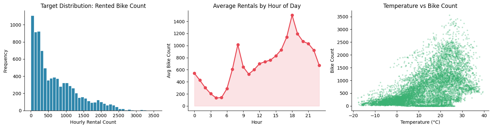

Speaker line:

"Demand is clearly non-linear over hour and temperature, so linear models are expected to underfit."

2. Correlation structure

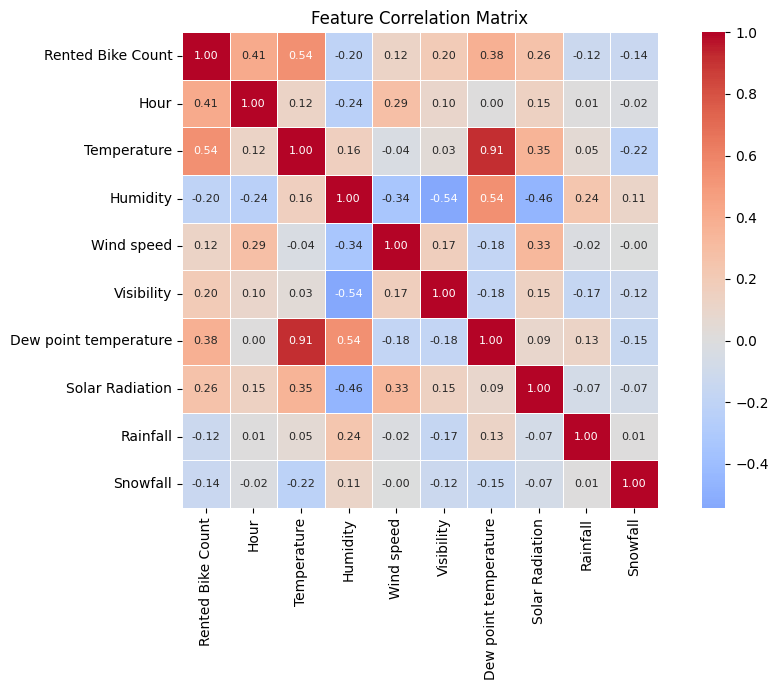

Speaker line:

"Correlation gives a rough linear view, but our final gains come from non-linear methods."

3. Polynomial degree behavior

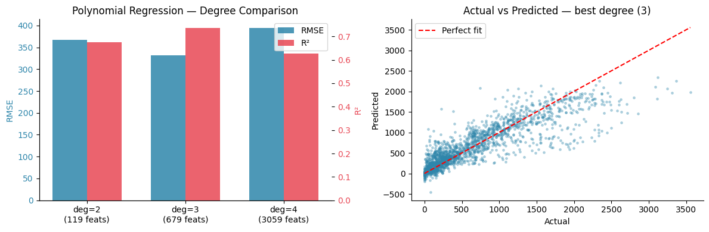

Speaker line:

"Moderate polynomial complexity helps, but too high a degree adds instability and overfitting risk."

4. Spline and step examples

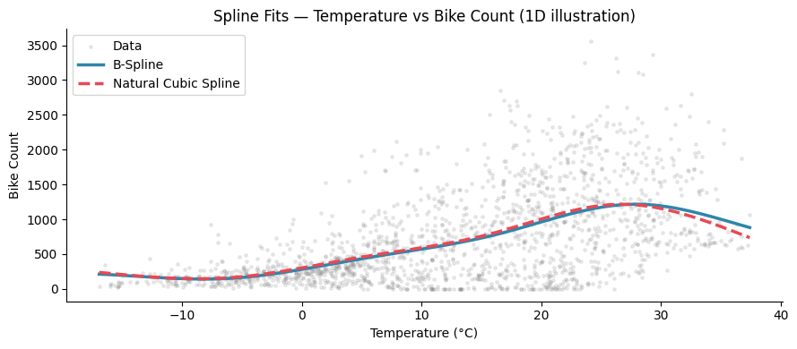

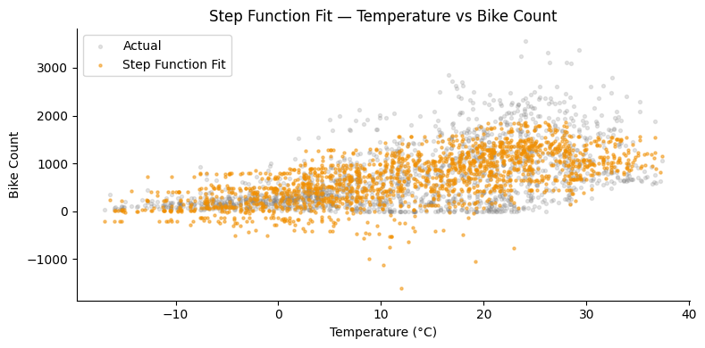

Speaker line:

"Splines capture smooth transitions, while step functions approximate abrupt regime changes."

5. GAM interpretability

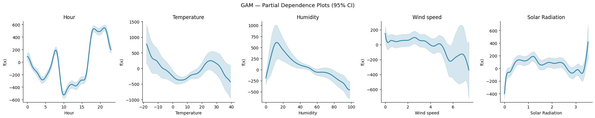

Speaker line:

"GAM gives us both strong predictive performance and interpretable feature effect curves."

6. Final regression comparison and diagnostics

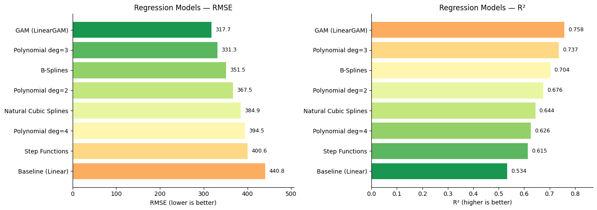

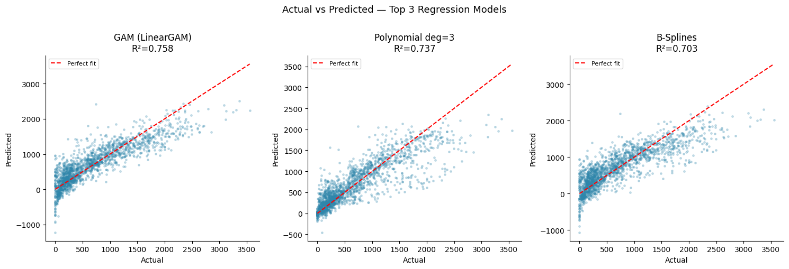

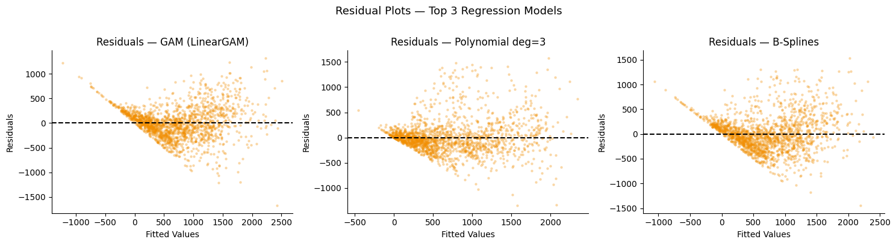

Speaker line:

"GAM has the strongest balance of fit quality and stable residual pattern among top models."

## 9.2 Classification Visuals

1. Class and protocol distributions

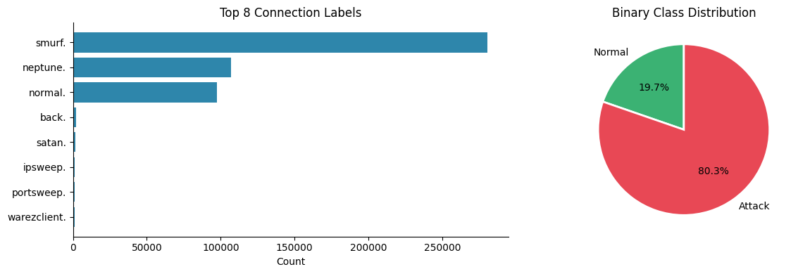

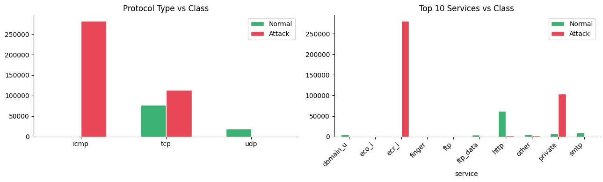

Speaker line:

"The dataset is class-imbalanced toward attack traffic, so F1 and AUC matter more than plain accuracy."

2. Feature distributions and importance

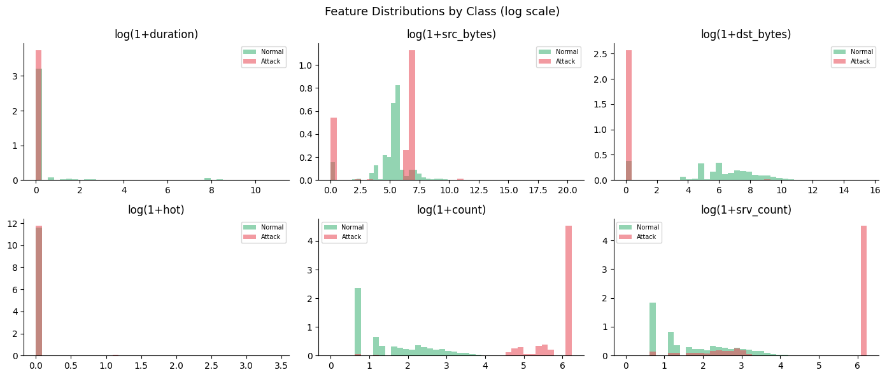

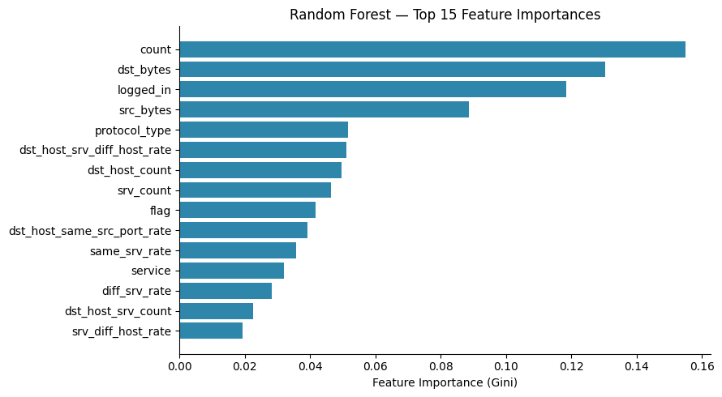

Speaker line:

"Top traffic volume features carry most predictive signal in intrusion detection."

3. Model behavior and comparison

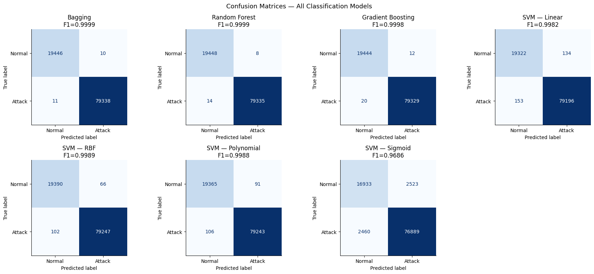

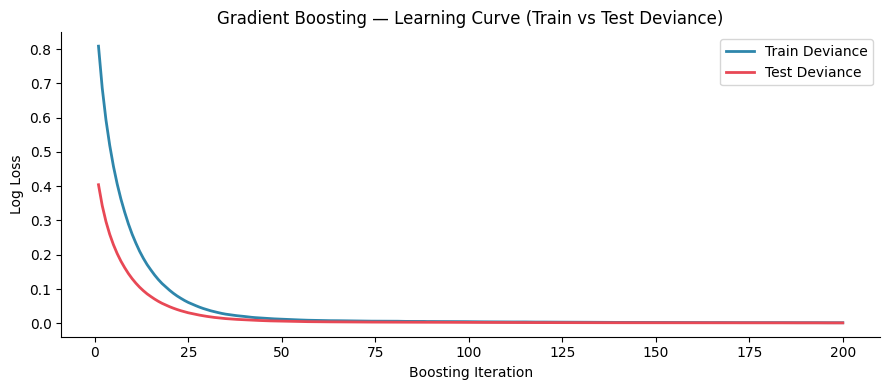

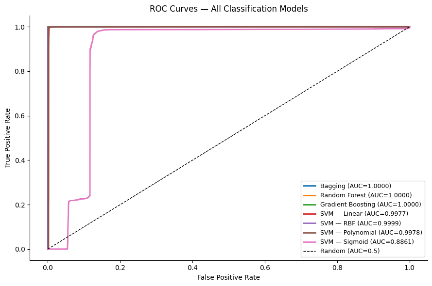

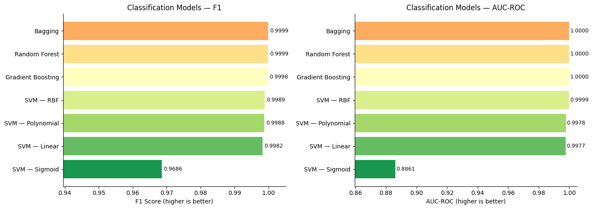

Speaker line:

"Tree ensembles and RBF SVM are consistently strong, while sigmoid SVM has the weakest boundary fit."

---

## 10) Quick 5-Minute Presentation Script

Minute 0:00 to 0:40 (Problem + Requirements)

- "Our goal was to complete all required methods: non-linear regression, tree classifiers, and SVM kernels, then compare them."
- "We followed a two-dataset strategy so each method family is used on the right task type."

Minute 0:40 to 1:30 (Datasets)

- "For regression we used Seoul Bike Sharing Demand because it has clear non-linear signals."
- "For classification we used KDD Cup 1999 intrusion detection as a robust benchmark for trees and SVM."

Minute 1:30 to 2:50 (Methods)

- "Regression side: baseline linear, polynomial, step, splines, LOESS, and GAM."
- "Classification side: bagging, random forest, gradient boosting, plus 4 SVM kernels."
- "SVM was trained on a 15,000-sample subset for computational feasibility."

Minute 2:50 to 4:10 (Results)

- "Best regression model: GAM with RMSE 317.70 and R2 0.7578."
- "Best classification performance: bagging and random forest, both around F1 0.9999 and AUC 1.0000."
- "Among SVMs, RBF kernel is best; sigmoid is the weakest."

Minute 4:10 to 5:00 (Conclusion)

- "Main takeaway: model choice should match data structure and scale."
- "For interpretable non-linear regression, GAM is excellent. For large-scale classification, tree ensembles are highly effective and practical."

---

## 11) Q&A Cheat Sheet (Fast Answers)

Q1. Why two datasets instead of one?

- Because the assignment explicitly asks for new regression and classification tasks. One dataset for both would force an unnatural setup and weaker conclusions.

Q2. Why is LOESS score lower?

- In this workflow LOESS is mainly a one-dimensional local smoother used for interpretation. It is not a full multivariate parametric model here.

Q3. Why not train SVM on the full classification dataset?

- Kernel SVM scales poorly with sample size (roughly O(n^2) to O(n^3) training cost), so a stratified subset was used for practical runtime.

Q4. Why are classification scores near-perfect?

- KDD Cup 1999 has strong separability for many attack patterns. We still compare multiple metrics and kernels to show model differences.

Q5. Which model would you deploy?

- Regression: GAM (best balance of performance and interpretability).  
- Classification: Random Forest or Gradient Boosting (high performance and scalable training/inference).

Q6. What are the main limitations?

- KDD Cup 1999 is an older benchmark and may not reflect modern traffic shifts. A follow-up on UNSW-NB15 would improve external validity.

---

## 12) Team Contributions

| Member | Main Contributions |
|---|---|
| Gabil Gurbanov | Task 1 non-linear regression models, regression plots, model comparison |
| Hamida Hagverdiyeva | Task 2 and 3 classification models, SVM kernels, ROC/confusion analysis |

---

## 13) Final Takeaways You Can Say in One Slide

- Non-linear regression methods clearly beat linear baseline on bike demand.
- GAM provided the best overall regression performance and interpretability.
- Tree ensembles and RBF SVM were top performers for intrusion detection.
- Kernel selection matters: sigmoid SVM underperformed strongly.
- The two-dataset strategy made comparisons cleaner and presentation clearer.

---

## 14) Optional Next Improvements (If Asked by Instructor)

1. Re-run classification on UNSW-NB15 for a modern benchmark comparison.
2. Add calibration curves and PR-AUC for the imbalanced attack class scenario.
3. Add statistical significance checks (bootstrap confidence intervals).
4. Add runtime and memory profiling for deployment-focused comparison.
